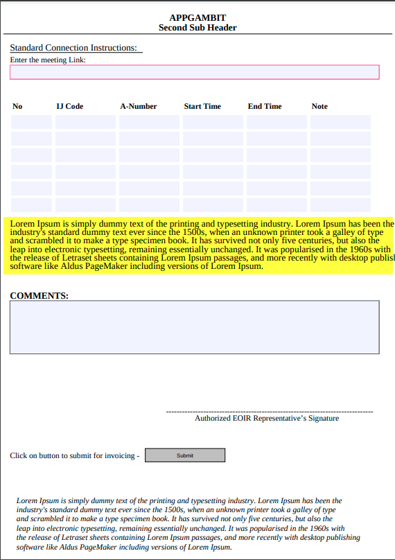

# PDF-Lib with NodeJS

This is a sample repo to generate PDF Forms.
This is tested with Node v16.20.1.

# Generate Editable PDF Forms

```bash
npm i
node index.js
```

# Use Existing Template

```bash
node template.js
```

# Template Output


